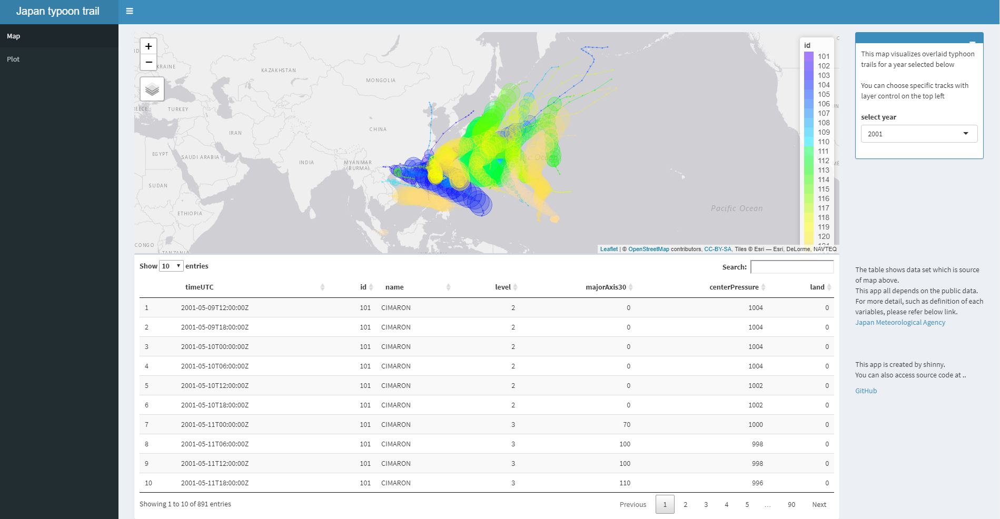

```{r setup, include=FALSE}
knitr::opts_chunk$set(echo = FALSE)
```

## Exective summary

This is an R Markdown pitch presentation introducing the app developed for 
the Course Project - Development of Data Productin Data science specialization course in Coursera.  


## Application overview

The app works with the data set regarding historical typhoon log sourced by, 
[Japan Meteorological Agency](https://www.data.jma.go.jp/fcd/yoho/typhoon/position_table/index.htm)  

Using the data set, this app visualizes below with intuitive user interaction,  
- Geographic map view made with leaflet() which enables user to see reactive overlaid track of typhoon trails.  
- Some plots answer basic questions about statistics of tyhoon such as "Is there any long term trend of tyoon occurance?"   

## Screen capture
```{r pressure, echo=TRUE, fig.cap="", out.width = '100%'}

```

## Links to jump in
- [App](https://toshi1979.shinyapps.io/typhoon/): Shinny Application web
- [Code](https://github.com/toshi1979/DevDataProduct): GitHub repository

